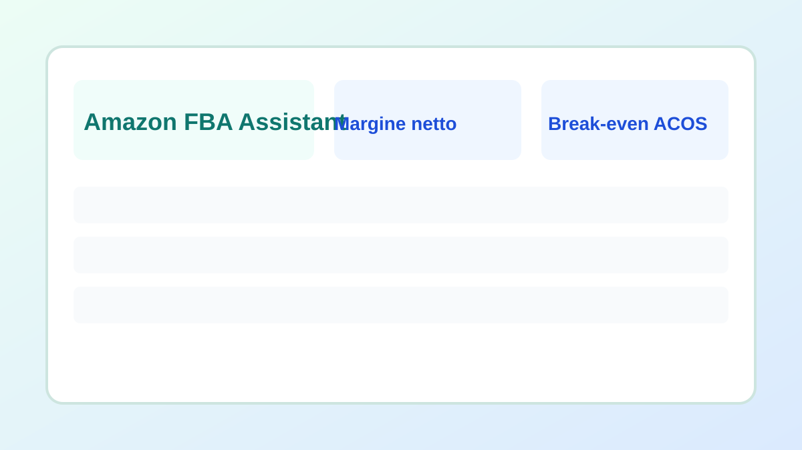
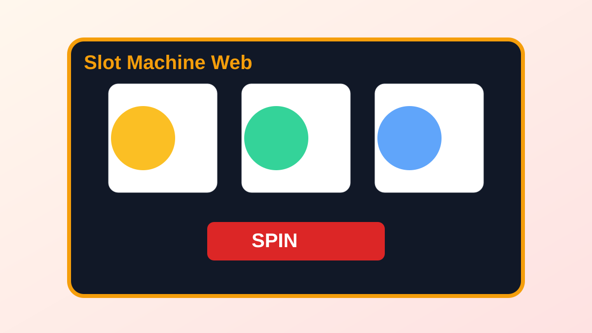
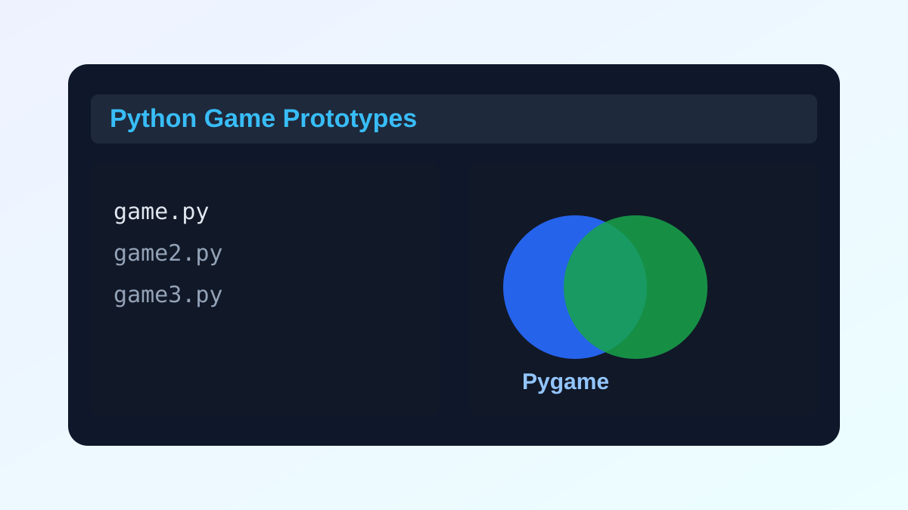

# Portfolio Projects

Homepage portfolio: apri `index.html`.

Questo repository contiene 3 progetti selezionati:

1. `amazon-fba-assistant` - Tool offline per analisi Amazon FBA (HTML + Python).
2. `slot-machine-web` - Mini progetto web slot (HTML/CSS/JS).
3. `python-game-prototypes` - Prototipi di giochi in Python/Pygame.

## Preview

## Come avviare

- **Homepage portfolio:** apri `index.html` nel browser.
- **Amazon FBA Assistant (senza terminale):** apri `amazon-fba-assistant/amazon_fba_helper.html` nel browser.
- **Slot web:** apri `slot-machine-web/index.html` nel browser.
- **Python games:** installa Python + dipendenze e lancia uno dei file in `python-game-prototypes`.
